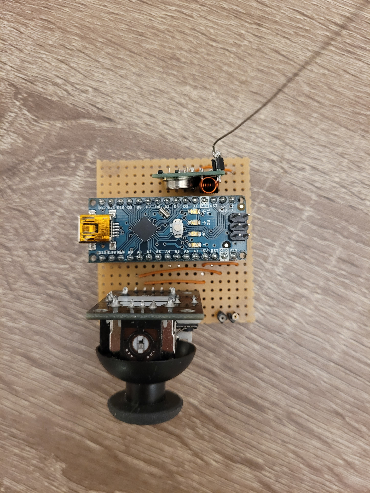
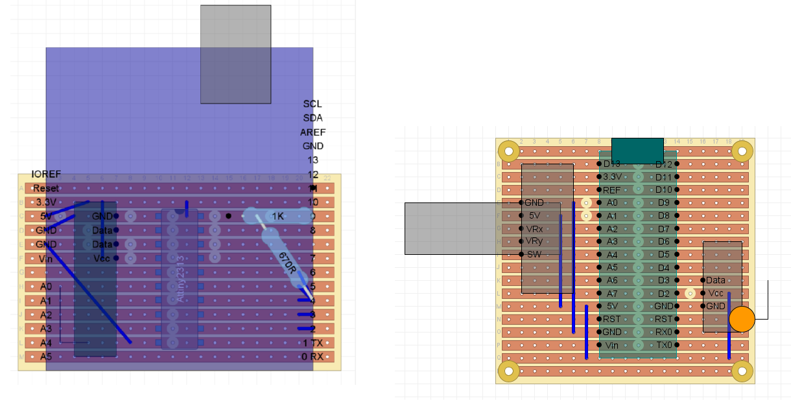
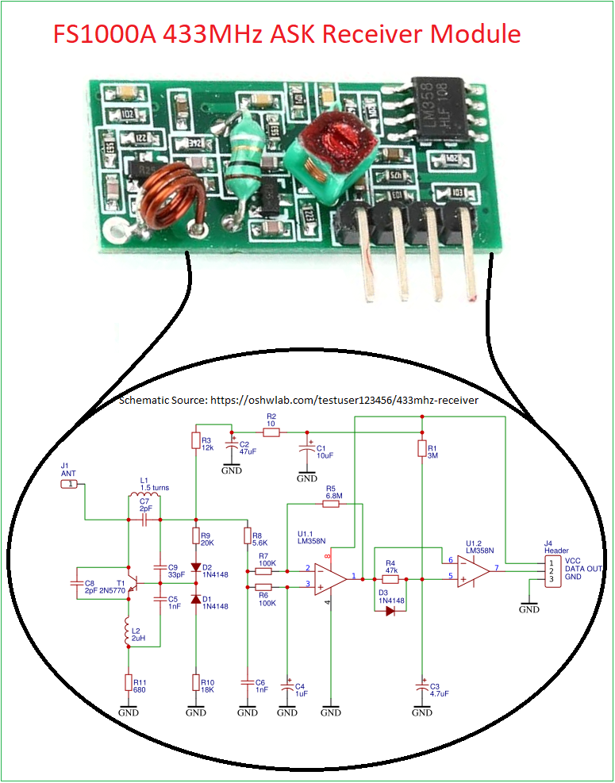
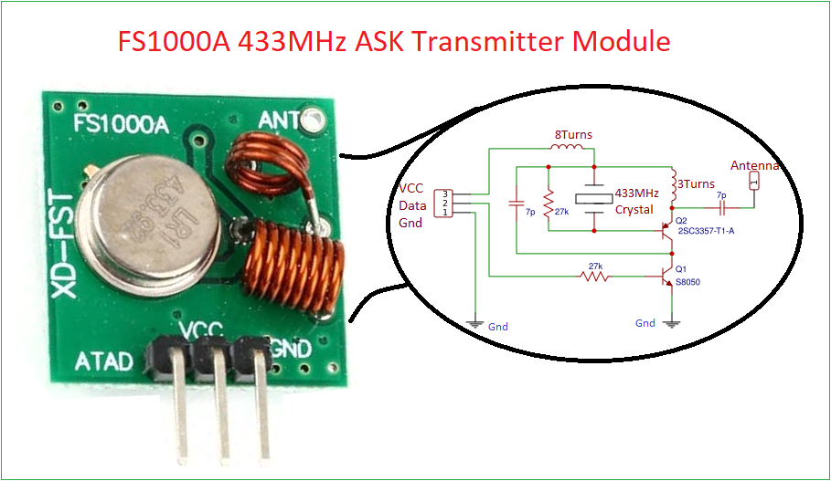
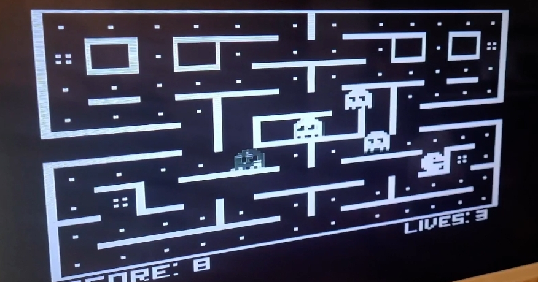
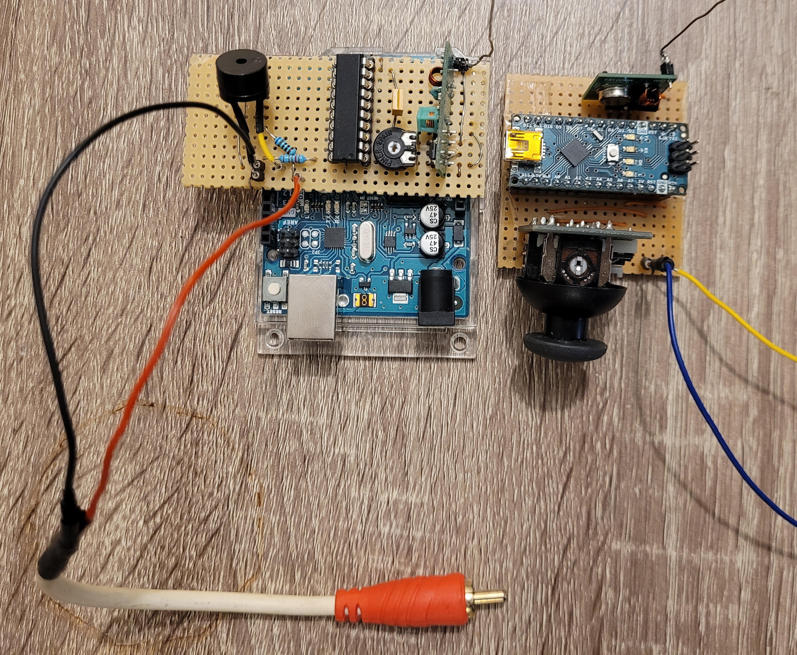

# Pac-Man Game Using Arduino & 433MHz Wireless Controllers

This project is a custom **Pac-Man game system** built from scratch using Arduino boards, custom PCBs, 433 MHz wireless modules, and a homemade controller.  
The game is **hosted on an Arduino Uno**, displayed via serial graphics, and controlled with a **wireless handheld controller** communicating through RF modules.

---

##  System Overview

The system consists of **three main hardware components**:

### 1. **Game Host – Arduino Uno**
- Runs the Pac-Man game logic  
- Renders the game map and characters  
- Receives control commands wirelessly  
- Handles game scoring, movement, ghosts, and collisions  

### 2. **Receiver PCB – ATtiny2313 + RF 433MHz Receiver**
This custom PCB acts as the wireless communication bridge:

- Microcontroller: **ATtiny2313**
- RF Module: **433 MHz ASK Receiver (FS1000A-compatible)**
- Decodes incoming controller commands  
- Converts RF packets to UART data for the Arduino Uno

### 3. **Wireless Handheld Controller – Arduino Nano + Joystick + 433MHz Transmitter**
A small custom controller PCB powered by an **Arduino Nano**:

- 2-axis joystick for Pac-Man movement  
- Push buttons (optional)  
- RF **433 MHz ASK transmitter**
- Sends commands encoded as address + action packets

---

##  Wireless Communication

The controller communicates with the receiver via:

- Frequency: **433 MHz**
- Modulation: **ASK/OOK**
- Transmission library: **VirtualWire / RadioHead (ASK mode)**  
- Commands encoded as small packets (`UP`, `DOWN`, `LEFT`, `RIGHT`)

The ATtiny2313 decodes packets and sends them to the game board using UART.

---

##  Project Photos

###  Hardware Boards
#### Controller PCB

#### Receiver PCB

###  PCB Design

###  RF Modules Used
#### 433MHz ASK Receiver

#### 433MHz ASK Transmitter

###  Gameplay & Prototypes
#### Playing the Game

#### Early Prototype

---

